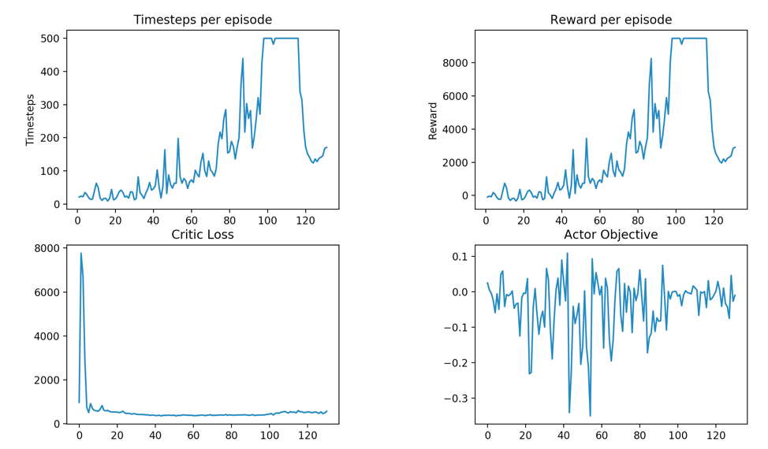
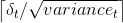
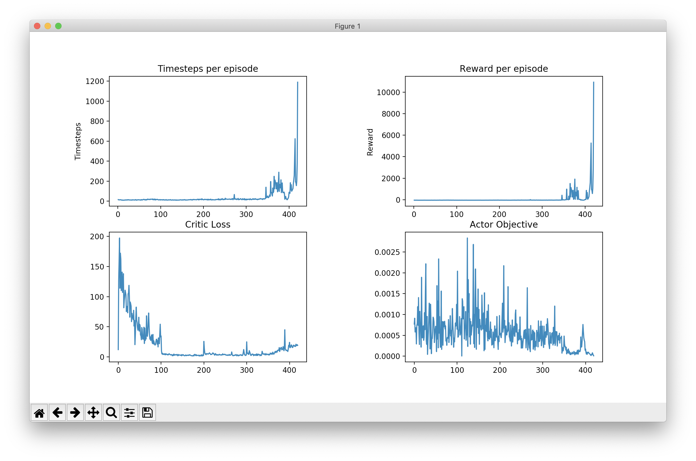

# Adaptive Systems

Project Description is available at [my university page](http://www.cs.toronto.edu/~shaktik/) under Proactive Troubleshooting [Aug2018-Present].

I will update this readme as I get more time, the individual files however have an extensive documentation.

```dqn.py```

This file gives a template for constructing a Deep Q Learning network. You can specify the no. of hidden units you want but for the moment it takes only one hidden layer.

```IRL/irl_finite_space.py```

This file implements the Finite Space IRL as put forth in Andrew Ng and Stuart Russel in [Algorithms for Inverse Reinforcement Learning](https://ai.stanford.edu/~ang/papers/icml00-irl.pdf). I used pulp based linear program solver but many people prefer using cvxopt package as well.

```dqn_sin_stability.py```

This is the most recent code I am stuck on (among many other codes :P ). This should ideally be a DQN implementation of stabilizing a sin function, or a general function. For any given continuous values of a noisy sin output, the agent should choose a noise correction scheme which smoothly approximates the sin function, or the function in consideration. Both the noise and the correction values can be continuous real values which makes this problem non trivial.

```acla_with_approxq.py```

Lately i realized that the function stabilization problem I was trying to handle couldnt be done without a continuos
action space consideration. As the first step towards Continuous Actor Critic Learning Algorithm (CACLA) proposed by [Hasselt and Wiering in Reinforcement Learning in Continuous Action Spaces](http://citeseerx.ist.psu.edu/viewdoc/download?doi=10.1.1.75.7658&rep=rep1&type=pdf)
I tried the the ACLA algorithm, which as you'd expect is just a slight variation of the DQN form. The file ```acla_with_approxq.py``` is an implementation of the ACLA with value function approximation. I tried out the following configurations, 
1. Actor and Critic with experience replays \[This training was by far the slowest I ever saw. There was a progress of 180 episodes over 8hours on an AMD Ryzen Threadripper 2990WX 128 GB\]
2. Combinations of fixing Q targets in Critic and Actor
3. Using dropouts in Actor
4. Combinations of stochastic/batch updates of critic/actor

Out of all these, updating Critic with experience replay without target scaling and actor in batch along with target scaling gave the best performance.
The environment was CartPole-v1. Timesteps of 500 were achieved within 100 episodes, a further learning rate decay for both actor and critic is expected to speed up this convergence.

The actor still has a high variance even though I used a one step TD error as the advantage. However this variance seems to die off once the convergence is achieved, something I'm still trying to explain to myself.

```acla_with_mc_returns.py```

This file performs an actor critic learning algorithm with monte carlo estimates of the returns.
Several experiments were performed and were found consistent with stochastic behaviors of the gradients.
The stochastic parameter updates were best with an SGD with learning rate scheduling and nesterov accelerated gradient.
However, a full batch gradient descent beat the sgd by a large margin and converged within 500 episodes for cartpole v1.

```cacla.py```
<br>So finally I was able to write the [Continuous Actor Critic Learning Algorithm](http://citeseerx.ist.psu.edu/viewdoc/download?doi=10.1.1.75.7658&rep=rep1&type=pdf). I benchmarked this against cartpole continuous environment.
The training started pretty low on enthusiasm, but to my surprise the algorithm hit 1189 timesteps in the 420th episode!
I used  number of updates towards an action where variance<sub>t</sub> is the running variance of the TD(0) error and &delta;<sub>t</sub> is the TD(0) error at time t.
A gaussian exploration was used. The Actor was trained in a full batch mode, the Critic used an experience replay with fixed targets updated every copy_epochs episodes.

It is worth appreciating the reduction in Actor's variance over time and the corresponding increase in the timesteps.

<br>
As always, if you'd like to know more about this research feel free to drop me an email.
