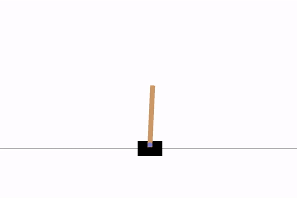

### CartPole-v0
This is the writeup referenced for [Leaderboard](https://github.com/openai/gym/wiki/Leaderboard#cartpole-v0) in solving cartpole-v0
### Script
The code is available here [playing_cartpole.py](playing_cartpole.py)

### Architecture

1. Critic : Network to approximate the value function <br> state_dimension -> 12 -> 12 -> 12 -> 1
2. Actor : Network with state_dimension -> 12 -> 12 -> 12 -> n_actions

Critic uses TD(0) learning + experience replay with buffer size 32. 
<br>Actor uses 1 step TD error + full batch gradient descent +  error normalization.
<br>Learning rates are 0.01 for both networks.
<br>Additional reward scaling was done to speeden the convergence. Note that this scaling can be removed and the results remain the same. 

### Training
```
Episode :  10 actor lr :  [0.01] critic lr :  [0.01] Actor Objective :  0.024398097991943358 Critic Loss 559.8967700195312 Avg Timestep :  50
Episode :  20 actor lr :  [0.01] critic lr :  [0.01] Actor Objective :  -0.056886939441456515 Critic Loss 578.5426851160386 Avg Timestep :  17
Episode :  30 actor lr :  [0.01] critic lr :  [0.01] Actor Objective :  -0.16414203141864978 Critic Loss 565.4473218415912 Avg Timestep :  76
Episode :  40 actor lr :  [0.01] critic lr :  [0.01] Actor Objective :  0.09517946736565952 Critic Loss 2224.6412879680765 Avg Timestep :  29
Episode :  50 actor lr :  [0.01] critic lr :  [0.01] Actor Objective :  -0.0010976457595825195 Critic Loss 621.600456237793 Avg Timestep :  200
Episode :  60 actor lr :  [0.01] critic lr :  [0.01] Actor Objective :  -0.026668670177459716 Critic Loss 620.4873565673828 Avg Timestep :  200
Episode :  70 actor lr :  [0.01] critic lr :  [0.01] Actor Objective :  -0.024512956142425536 Critic Loss 515.2374238586426 Avg Timestep :  200
Episode :  80 actor lr :  [0.01] critic lr :  [0.01] Actor Objective :  -0.024707696437835693 Critic Loss 480.76589309692383 Avg Timestep :  200

```
The convergence to 200 timesteps was found as early as 40th episode.


### Testing
```
Episode : 1 : Total timesteps = 200, total reward = 200.0
Episode : 2 : Total timesteps = 200, total reward = 200.0
Episode : 3 : Total timesteps = 200, total reward = 200.0
Episode : 4 : Total timesteps = 200, total reward = 200.0
Episode : 5 : Total timesteps = 200, total reward = 200.0
```
